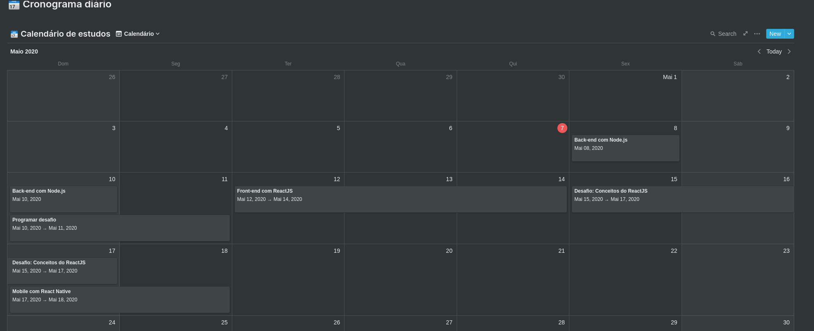

## Sobre o desafio

Nesse desafio, eu deveria planejar meus estudos

Para isso, criei com base no modelo fornecido o planejamento com base no meu tempo disponível no momento.

### Modelo de cronograma

O modelo utilizado para geração está disponível abaixo e foi fornecido pela Rocketseat

📄 **[Link para o modelo](https://www.notion.so/Cronograma-de-estudos-e390bc8d2f5743668ec03348a3306070)**

### Definindo o cronograma semanal

  

### Definindo o cronograma diário

  

